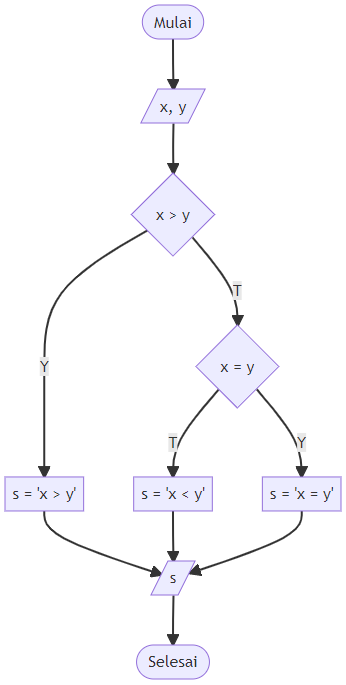

# draw_flowchart
Dengan menggunakan [Mermaid](https://mermaid-js.github.io/mermaid/#/) dapat dibuat beraneka [diagram alir](https://mermaid-js.github.io/mermaid/#/flowchart).


```python
%load_ext nb_js_diagrammers
```

## sign
Suatu variabel $x$ dapat dapat memiliki tanda positif (+1), nol (0) atau negativ (-1) mengikuti

<a name='eqn1'></a>
\begin{equation}\tag{1}
{\rm sign}(x) = \left\{
\begin{array}{rl}
+1, & x > 0\newline
0, & x = 0 \newline
-1, & x < 0.
\end{array}
\right.
\end{equation}

Persamaan ([1](#eqn1)) ini dipergunakan salah satunya untuk menentukan arah dari suatu vektor.

## example
Berikut ini adalah contoh penggunaan Mermaid untuk membuat diagram alir menentukan tanda dari suatu bilangan.


```python
%%mermaid_magic -h 720

flowchart TD
    B([ Mulai ]);
    E([ Selesai ]);
    I[/ x /];
    D1{ x > 0};
    D2{ x = 0};
    S1[ sign = 1];
    S2[ sign = 0];
    S3[ sign = -1];
    O[/ sign /];
    B --> I;
    I --> D1;
    D1 -- Y --> S1;
    D1 -- T --> D2;
    D2 -- T --> S3;
    D2 -- Y --> S2;
    S1 --> O;
    S2 --> O;
    S3 --> O;
    O --> E;
```


<iframe srcdoc="&lt;html&gt;
    &lt;body&gt;
        &lt;script src=&quot;https://cdn.jsdelivr.net/npm/mermaid/dist/mermaid.min.js&quot;&gt;&lt;/script&gt;
        &lt;script&gt;
            mermaid.initialize({ startOnLoad: true });
        &lt;/script&gt;

        &lt;div class=&quot;mermaid&quot;&gt;

flowchart TD
    B([ Mulai ]);
    E([ Selesai ]);
    I[/ x /];
    D1{ x &gt; 0};
    D2{ x = 0};
    S1[ sign = 1];
    S2[ sign = 0];
    S3[ sign = -1];
    O[/ sign /];
    B --&gt; I;
    I --&gt; D1;
    D1 -- Y --&gt; S1;
    D1 -- T --&gt; D2;
    D2 -- T --&gt; S3;
    D2 -- Y --&gt; S2;
    S1 --&gt; O;
    S2 --&gt; O;
    S3 --&gt; O;
    O --&gt; E;

        &lt;/div&gt;

    &lt;/body&gt;
&lt;/html&gt;
" width="100%" height="720"style="border:none !important;" "allowfullscreen" "webkitallowfullscreen" "mozallowfullscreen"></iframe>


Diagram alir di atas merupakan penerapan dari menurut Persamaan ([1](#eqn1)).

Untuk dapat menggambarkan diagram alir di atas secara lokal perlu dinstal [nb-js-diagrammers](https://pypi.org/project/nb-js-diagrammers/0.0.7/). Dan untuk melihatnya di GitHub cukup dibuat suatu berkas Markdown seperti [draw_flowchart_sign.md](draw_flowchart_sign.md).

## comparing two number
Salah satu diagram alir untuk membandingkan dua buah bilangan adalah sebagai berikut.



Koreksi kode berikut untuk mendapatkan hasil di atas.

%%mermaid_magic -h 720

flowchart TD
    B([ Mulai ]);
    E([ Selesai ]);
    I[/ x, y /];
    D1{ x > y};
    D2{ x = y};
    S1[ s = 'x > y'];
    S2[ s = 'x < y'];
    S3[ s = 'x = y'];
    O[/ s /];
    B --> I;
    I --> D1;
    D1 -- Y --> S1;
    D1 -- T --> D2;
    D2 -- T --> S3;
    D2 -- Y --> S2;
    S1 --> O;
    S2 --> O;
    S3 --> O;
    O --> E;

Hasil kode di atas dapat dilihat pada berkas [draw_flowchart_compare_two_numbers.md](draw_flowchart_compare_two_numbers.md).
